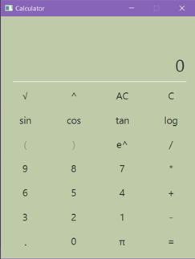

#Calculator

This is a basic scientific calculator application which can calculate simple scientific mathematical expressions. 

##Features

* Can calculate arithmetic, logarithmic and trigonometric expressions.
* Allows entry of multiple values.

## Screenshots

